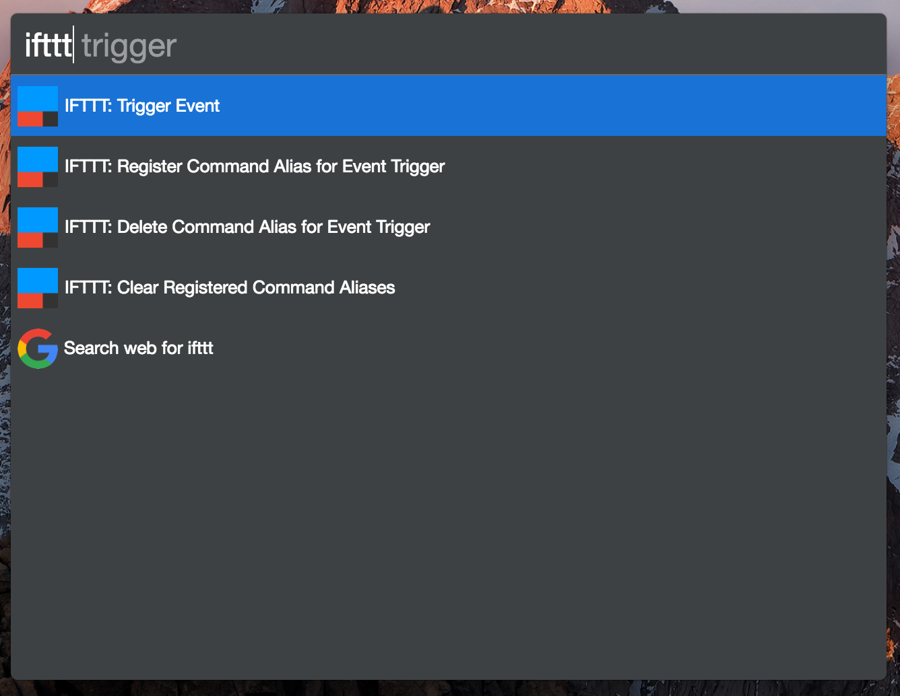

# cerebro-plugin-ifttt

> [Cerebro](https://cerebroapp.com) plugin to integrate with IFTTT using the Maker Webhook.

## Usage

**Important Note**: Make sure to setup the Maker Webhook Service on IFTTT and add the key to the settings for the plugin (as explained [here](./docs/setup.md)).

### Trigger an Event

Type `ifttt trigger <event>` to trigger an event directly.

You can pass in 3 arguments, separated by a space to act as `value1`, `value2`, and `value3`

### Register Command Alias

Type `ifttt register <command> <event> [<description>]` to save a shortcut to an event.
Then you can just type the command with arguments similar to `ifttt execute`.

### Delete Command Alias

Type `ifttt register <command>` to delete a specific command alias.

### Clear Command alias

Type `ifttt clear` to clear all command aliases.

## Installing

* Type `plugins ifttt` into Cerebro
* Click `install`

## Related

- [Cerebro](http://github.com/KELiON/cerebro) – main repo for Cerebro app;
- [IFTTT](https://ifttt.com/) - "Do more with the services you love."

## License

MIT © [Matthew Jacobs](https://www.mattjdev.com)
