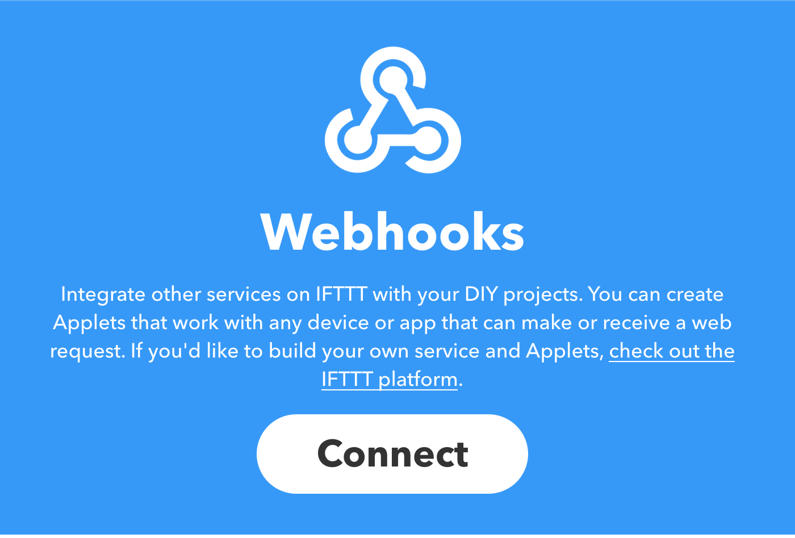
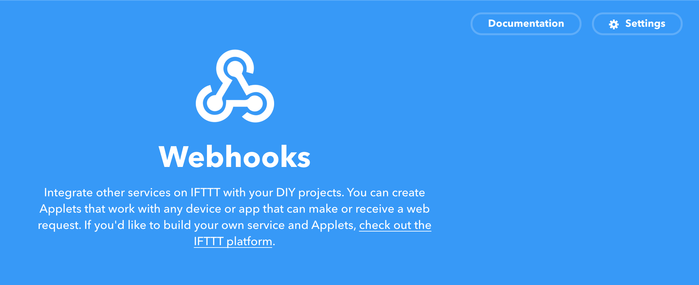
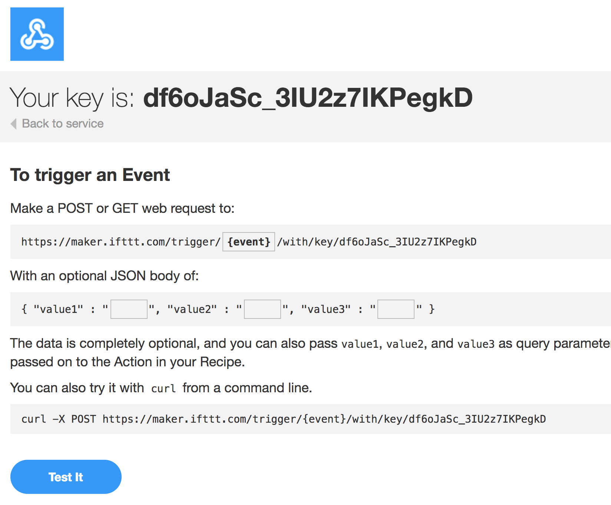
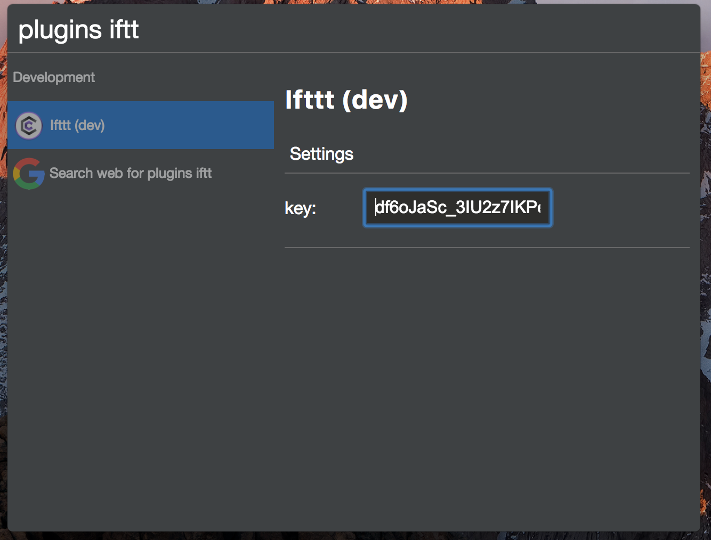
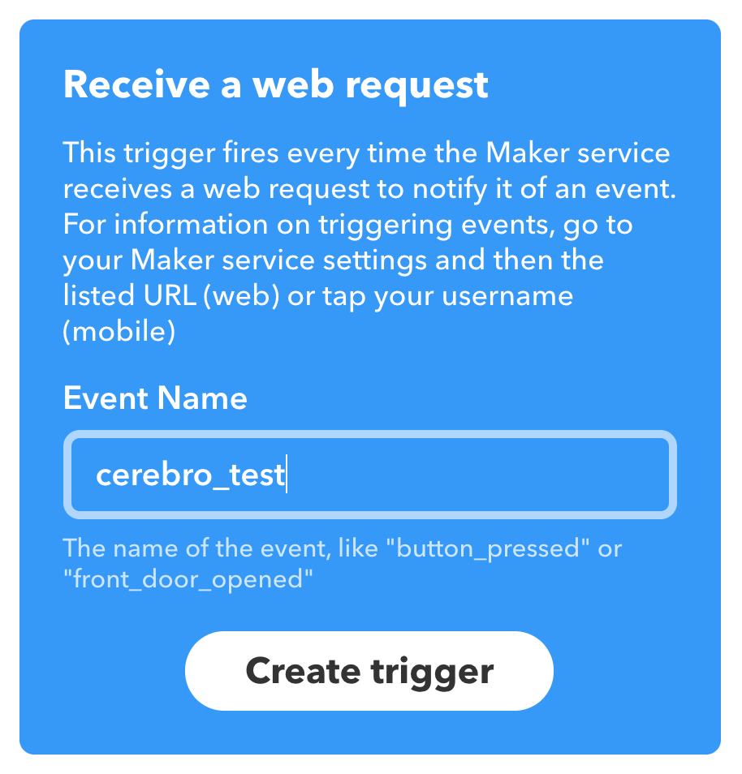
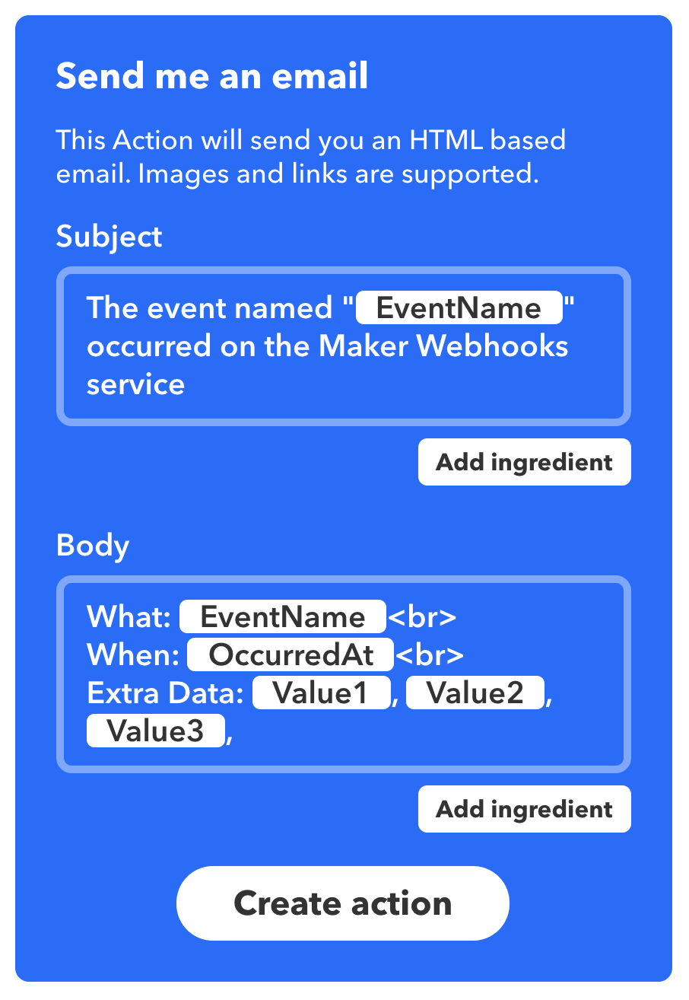
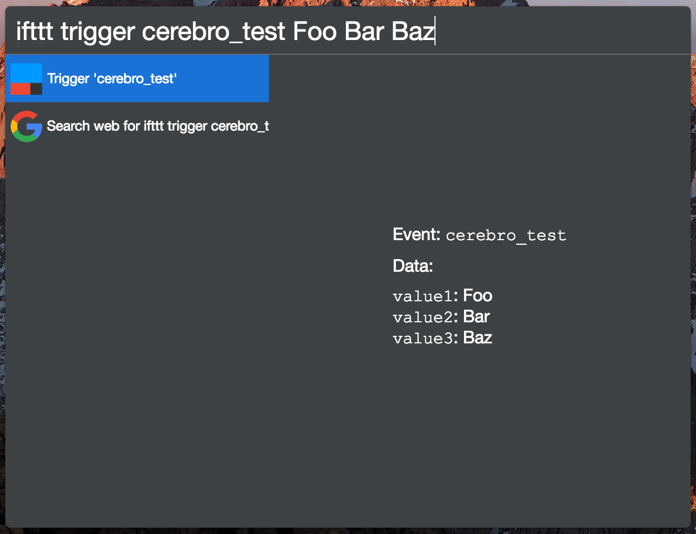

# IFTTT Setup

## Setup Webhook Service

1. Make sure you are logged into IFTTT
2. Go to https://ifttt.com/maker_webhooks
3. Click Connect

4. Click Documentation in the top right corner

5. Find Webhook Service Key

## Copy Webhook Key into IFTTT Plugin

1. Place Webhook Service Key into Plugin Settings

## Setup Test Service

1. Go to https://ifttt.com/create
2. Click on `+this`
3. Search and select Webhooks
4. Choose "Receive a web request" trigger
5. Type in an event name and click Creat trigger

6. Click on `+that`
7. Select Email (You can choose whatever you'd like, but this example uses the Email service)
8. Choose "Send me an email" trigger
9. Click Create action

10. Click Finish
11. Open up Cerebro and type "ifttt trigger cerebro_test Foo Bar Baz"

12. Check email for message from action
